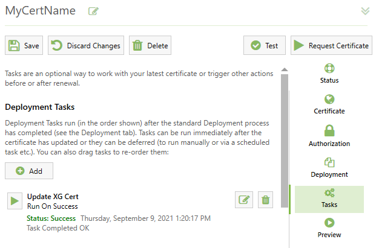
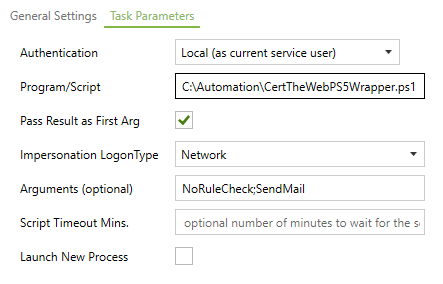

# XG Cert Renewal

#### What This Is
PowerShell 7 scripts to help automate cert renewals in XG from a Windows machine.
#### What This Does
Uses output triggers from Certify The Web to push updated Let's Encrypt certificates into Sophos XG.
#### What Makes You Care
Unless you are a small business or home user of Sophos XG who wants to automate certificate management, you probably don't.
#### What You Need
* [Sophos XG]( https://www.sophos.com/en-us/products/next-gen-firewall.aspx)
* [PowerShell 7]( https://github.com/PowerShell/PowerShell/releases/latest)
* [Certify The Web](https://certifytheweb.com/)
* A desire to stop manually updating [Let’s Encrypt](https://letsencrypt.org/) certificates.
## A Bit More Detail
Sometimes whoever manages XG in a small business or home office just doesn't have time to maintain all the random pet projects they once did. Or perhaps these people are tired of trying to remember why they created a bash script 3 years ago that almost looks like it isn't doing anything useful anymore. Almost. Sometimes these people simply want a point-and-click method to make things *just work* using their daily driver OS.

If you, like me, are in this boat then you may have discovered perhaps the easiest method of maintaining Let’s Encrypt certificates right from your home office Windows machine. If you haven’t, let me be the first to introduce you to **[Certify The Web](https://certifytheweb.com/)**. This handy tool is free for individual use and will automatically renew your Let’s Encrypt certs for you in the background. It will also deploy them to some of the more common destinations.

Unfortunately, Sophos XG is not exactly a common deployment destination for most people using Let’s Encrypt certificates managed by a Windows based GUI driven application. This is where the XG Cert Renewal PowerShell scripts come into play. By hooking into the Certify The Web post-renewal actions, these scripts can leverage the Sophos XG API to keep your Let’s Encrypt certificates maintained without any user input.
## About the Scripts
### Update-XGCert.ps1
All of the magic happens in this guy. It is written with some PowerShell 7 syntax because that was easier to work with. There are a few variables towards the top of this script that you will need to set before running it the first time. Here, let me show you that part of the file…
```powershell
<#
 == Output Log File Variables ==
 $LogFile - Transaction log. Defaults is  "$(Split-Path $MyInvocation.MyCommand.Path -Parent)\$CertName.log".
 $ReuseLog - $true will truncate the log on each run, $false will simply append.
#>
$LogFile = "$(Split-Path $MyInvocation.MyCommand.Path -Parent)\$CertName.log"
$ReuseLog = $true

<#
== XG Login Variables ==
$XGURI - The name or IP and port of your XG instance
$XGUser - The api user name
$XGPass - The api user password
$XGPassEncrypted - $true to use "encrypt" or $false for "plain"
#>
$XGURI = 'https://xg.domain.name:4444'
$XGUser = 'api admin'
$XGPass = 'correcthorsebatterystaple'
$XGPassEncrypted = $false

<#
== Email Varables ==
$MailFrom - who is sending the mail
$MailTo - where to send the mail
$SMTPServer - the hostname or IP address of the relay SMTP server
#>
$MailFrom = "Some User some.user@domain.name"
$MailTo = "Another User another.user@domain.name"
$SMTPServer = "smtp.domain.name"
```
Perhaps a bit more information is in order here just to get you started. The LogFile variable comes out-of-the-box set to write to whatever folder the script is located in. The email variables can be ignored unless you really do want the e-mail. In that case, you just need an MTA relay on your network you can put in the SMTPServer variable… which you have if you met the first criteria in **How To Use**. Everything else should be self-explanatory. To test your variables, just run the script in Dry Run mode.

What?

Oh yeah, the script can be run directly from a PowerShell terminal with various parameters. Take a look at this neat help output you get from the console since I actually took the time to put documentation in the code...

```shell
PS > Get-Help .\Update-XGCert.ps1 -Detailed


NAME
    Update-XGCert.ps1

SYNOPSIS
    Performs Certificate Updates in Sophos XG Firewall


SYNTAX
    Update-XGCert.ps1 [-CertName] <String> [-CertFile] <String> [-NoRuleCheck] [-DeleteCert] [-DryRun] [-SendMail]


DESCRIPTION
    For appliance certificates or WAF certificates that are not used in any rules, this script will simply
    update the cert in XG. For in-use WAF certificates, the script will upload the new cert with a temporary
    name, modify the rules to use the temp cert, update the original cert, repoint the rules back to the
    original cert, fix rule groups, and then delete the temporary cert.


PARAMETERS
    -CertName <String>
        Specifies the name of the Certificate in XG.
        
    -CertFile <String>
        Specifies the full path of the new PFX Certificate file.

    -NoRuleCheck [<SwitchParameter>]
        If used, the script will skip checking for impacted rules and just update the cert in-place. Use when
        the cert is not in use or when used only by appliance services such as user portal.

    -DeleteCert [<SwitchParameter>]
        If used, the script will delete the PFX file identified in the CertFile parameter.
        
    -DryRun [<SwitchParameter>]
        If used, only simulates the actions that would have been taken.

    -SendMail [<SwitchParameter>]
        Sends log file in email. Mail variables in this script must be set.

-------------------------- EXAMPLE 1 --------------------------
PS> Update-XGCert.ps1 -CertName "My WAF Certificate" -CertFile ".\MyWAFCert.pfx"

-------------------------- EXAMPLE 2 --------------------------
PS> Update-XGCert.ps1 -CertName "My XG Cert" -CertFile ".\MyXGCert.pfx" -NoRuleCheck
```
### CertTheWebWrapper.ps1
So, remember how I said the main script uses PowerShell 7 syntax?  I should have checked before I wrote it, but apparently Certify The Web currently only pipes results output to PowerShell **5**. Until that gets fixed, this small wrapper script is needed. It doesn’t do much of anything except accept the input from Certify The Web, log what it received to its own little log file, and then forwards the arguments on to the *real* script in a PowerShell 7 environment. Honestly, that’s it. I didn’t even bother to put comments in the script.
## How To Use
The basic steps are as follows:
1. Have a Sophos XG instance [configured for API administration]( https://docs.sophos.com/nsg/sophos-firewall/18.0/Help/en-us/webhelp/onlinehelp/nsg/sfos/learningContent/APIUsingAPI.html).
2. Put the two PowerShell scripts from this project on your computer somewhere.
3. Edit the variables in the `Update-XGCert.ps1` script.
4. Configure Certify The Web to call the wrapper script after cert renewal.
5. Take a nap.
### Script Setup
The PowerShell scripts can be located just about anywhere that the Certify The Web client can get to. Local machine is probably best.  To start, just enter your XG API admin user credentials in the appropriate variables inside the `Update-XGCert.ps1` file. Leave the mail and log variables alone for now. Next, launch a PowerShell 7 console in the directory where the scripts are and then run…
```powershell
PS > .\Update-XGCert.ps1 -CertName NotACert -CertFile NotAFile
```
You should see the result …
```shell
Missing Cert File: NotAFile
```
And there should also be a new log file in the same directory named `CertName.log` which ought to look like this inside…
```log021-09-10 13:32:46Z : ------------------------------------ BEGIN TRANSACTION ------------------------------------
2021-09-10 13:32:46Z : Working certificate NotACert with file NotAFile and rule check.
2021-09-10 13:32:46Z : --- ERROR ---
2021-09-10 13:32:46Z : Missing Cert File: NotAFile
2021-09-10 13:32:46Z : Last XML Sent to XG:
```
Excellent, you now see how this works. Sort of. You can delete that log file.
### Testing The Script
Find yourself a good (up to date) PFX file that you want to load to XG.  For testing purposes, it can be anything, just as long as it is valid and XG will actually accept it.  Next, place this certificate into the same folder as your certs and from your Power Shell 7 console try this…

```powershell
PS > .\Update-XGCert.ps1 -CertName TestCert -CertFile .\[pfx file name].pfx
```

If you get an error, go check your variables or that you typed the command correctly. No output is good output. Assuming all went well, you should now have a `TestCert.log` file with some goodies inside as well as a brand new TestCert loaded on your XG instance. You can delete both the log and the cert (on XG and in this folder) if you want, or you can use this opportunity to try a few other things like so...

```powershell
PS > .\Update-XGCert.ps1 -CertName TestCert -CertFile .\[pfx file name].pfx -DryRun -SendMail
```
This will take a bit longer because without the `-NoRuleCheck` flag, the script will log into XG and pull down all the rules to see which ones use the TestCert. After that, the `-DryRun` flag will cause the script to just print the API XML to the log file instead of actually sending the commands to XG. This way you can see what would happen without actually having to do it. After that, the `-SendMail` flag will send you the log statements, assuming of course you actually configured the email variables. I know I told you to skip that for now, but you didn't actually listen and you actually got the e-mail, didn't you? Anyway, this should give you enough information to see how you can test and debug the primary script actions and variable settings.

Oh, I should also note that when you use the `-SendMail` flag you will probably get some kind of warning on the console like this...

> WARNING: The command 'Send-MailMessage' is obsolete. This cmdlet does not guarantee secure connections to SMTP servers. While there is no immediate replacement available in PowerShell, we recommend you do not use Send-MailMessage at this time

The message should be self-explanatory. If you feel like forking this repo and fixing that by adding additional mail helper utilities, please feel free. If, however, you are like me and don't mind sending unsecured email that has nothing sensitive in it on your private network then just go ahead and do what I do which is ignore the warning.

### Configuring Certify The Web
Once you have a handle on how the script works, it's time to hook it into Certify The Web. Rather than explain that tool, I'll just point to the [documentation](https://docs.certifytheweb.com/docs/intro). Read that and come back. Unless you already know how to use Certify The Web, in which case just keap going.

*Time passes...*

Now, once you have your certificate setup to renew, it's time to add a post-renew task. Two things will make this easier. The first thing is to give your certificate in Certify The Web the same name that you use in XG. For example, in the image below the name **MyCertName** is what this certificate is called both here and in XG. This is not mandatory, but it helps.

<p align="center">

</p>

Anyway, from your certificate details, add a new Deployment Task of type **Run Powershell Script**. Name the task whatever you want and set the trigger to **Run On Success**. Then, configure the Task Parameters as follows:

* Authentication: Local seems to work fine
* Program/Script: the location of the **CertTheWebPS5Wrapper.ps1** script, which should be in the *same* folder as the other one you have been testing.
* Pass Result as First Arg: Yes, check this.
* Impersonate: Eh, Network is good.
* Arguments: See the section **Passing Arguments** below.

<p align="center">

</p>

When you have everything the way you want it, you can run the action (that green play arrow next to the action) to ensure it works without having to wait until the next renewal.

**Pro Tip:** Set the DryRun flag the first time you do this.

### Passing Arguments
Certify The Web handles argument passing for PowerShell scripts in a weird way. But it works. Basically, each argument should be entered as Key=Value and separated with a semicolon. No leading dash. The `CertName` and `CertFile` parameters will be pulled from the results passed in by the action hook. But, you can overwrite those values by explicitly including those parameters.

#### Example 1
Certificate has the *same* name in Certify The Web and XG and you only want to test what would happen.
>Arguments `DryRun`

#### Example 2
Certificate has a *different* name in Certify The Web and XG and you only want to test what would happen plus get an email.
>Arguments `CertName=XGCertName;DryRun;SendMail`

### Example 3
Certificate is only used for XG portal access, has the same name in both places, and you want the email.
>Arguments `NoRuleCheck;SendMail`

## What Goes On Behind the Scenes
Here is an overview of what happens in the script.

1. Check to see if the PFX file exists and terminate if it doesn't.
2. Check to see if XG has a certificate matching CertName. If not, skip to step 8.
3. Check to see if the NoRuleCheck flag is present. If so, skip to step 8.
4. Pull all the Firewall Rules and look for any that use our cert. If none found, skip to step 8.
5. Pull all Firewall Rule Groups and look for Groups that use our rules.
6. Upload our certificate as a new, temporary certificate.
7. Update all the rules to use this new, temporary certificate.
8. Upload our certificate as an update to the original in XG, or a new certificate if it did not already exist.
9. If we had affected Rules, update them back to the original certificate.
10. If we had groups, put them back because the XG API has a bug.
11. If we had a temporary certificate, delete it.
12. If the DeleteCert flag was present, remove the PFX source file so it isn't haging out on the computer.
13. If the SendMail flag was present, send a summary of what was done.